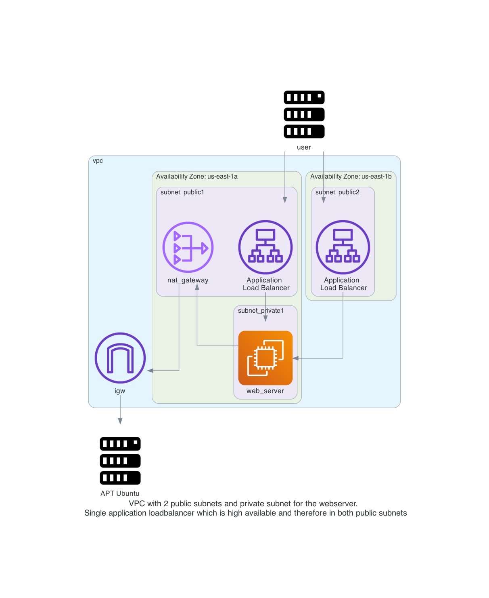

# aws_https_loadbalancer_nginx

In this repository you will deploy a webserver behind an application load balancer with Terraform on AWS. The webserver will be made available over the load balancer with a valid SSL certificate.

Steps involved are: 
- Create a VPC with subnets, routing tables, internet gateway and nat gateway
- Creating an EC2 instance with Ubuntu in a private subnet with no public ip address
- Creating a Security group that allows traffic over port 80 and 443 to the load balancer and webserver
- Create an application load balancer to forward https traffic to the web server in the private subnet
- Point the DNS name for the website to the loadbalancer

Detailed diagram of the environment:  
     

# done
- [x] create VPC
- [x] create 2 subnets, one for public network, one for private network
- [x] create internet gw and connect to public network with a route table
- [x] create nat gateway, and connect to private network with a route table
- [x] route table association with the subnets 
- [x] security group for allowing port 80 and 443

# to do
- [] create ec2 instance without public ip, only private subnet
- [] import SSL certificate
- [] create a LB (check Application Load Balancer or Network Load Balancer)
- [] publish a service over LB, ie nginx
- [] create DNS CNAME for website to loadbalancer DNS