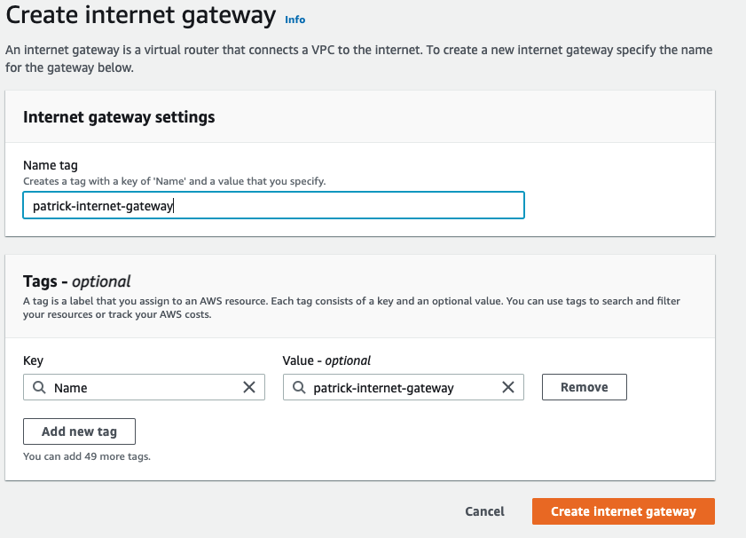
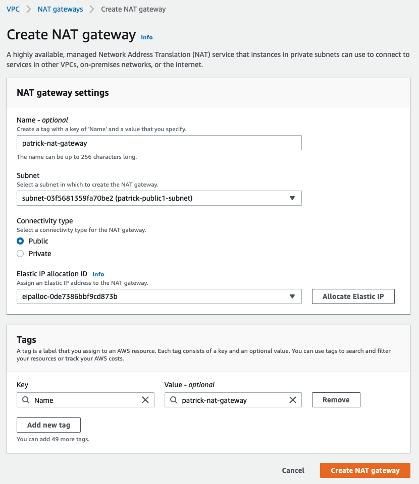
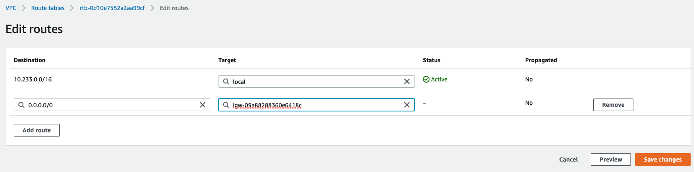

# Manual steps

This document describes the manual steps for creating a webserver behind a loadbalancer which you can then connect to over the internet using https. The webserver is in a private subnet

See below diagram for how the setup is:


- Create a VPC with cidr block ```10.233.0.0/16```  
  
- Create 3 subnets. 2 public subnets and 1 private subnet
    - patrick-public1-subnet (ip: ```10.233.1.0/24``` availability zone: ```us-east-1a```)  
    - patrick-public2-subnet (ip: ```10.233.2.0/24``` availability zone: ```us-east-1b```)  
    - patrick-private1-subnet (ip: ```10.233.11.0/24``` availability zone: ```us-east-1a```)  
  
  
  
  
- create an internet gateway  
    
  
- create a nat gateway which you attach to ```patrick-public1-subnet```   
  
- create routing table for public  
  
   - edit the routing table for internet access to the internet gateway
     
- create routing table for private  
     
   - edit the routing table for internet access to the nat gateway  
      
- attach routing tables to subnets  
    - patrick-public-route to public subnets      
          
    - patrick-private-route to private subnet   
         
- create a security group that allows http and https from all locations    
    
- create an ec2 instance that install nginx software from the start  
      
    
    
    - Use the following code to automatically install and start the nginx server
```
#cloud-config
runcmd:
  - apt-get install -y nginx
  - systemctl enable --no-block nginx 
  - systemctl start --no-block nginx 
````
    
    
    

    
  
- Import the certificate you want to use on the load balancer
- Go to AWS Certificate Manager  
  
- Select import
- Copy your certificate information in   
  
- give the tag a name  
  
- review and select import  
  
- Certificate should now be available
  
- loadbalancer create a target group  
    
    
    
- Load balancer - Application  
    
    
  
select you security group
  
Listener should listen for https and forward it to your target group    
  
Choose to use the certificate that you imported in ACM  
  
- loadbalancer generated a DNS name. If you connect to that name with https you will get an error stating that the name certificate is not valid  
  
- Go to route53 and change your dns record to point to the dns name of the loadbalancer    
  
- Wait for a few moments and then you will be able to successfully connect    
https://patrick.bg.hashicorp-success.com/  
   


